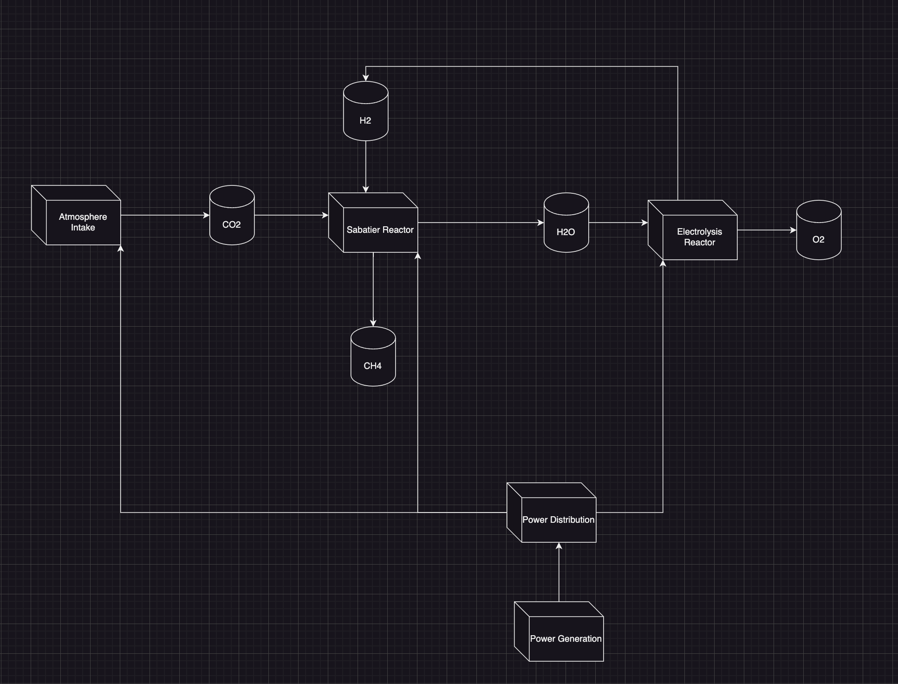

# PyISRU

# Refferences
[Carbon Dioxide Methanation: Design of a Fully Integrated Plant](https://pubs.acs.org/doi/10.1021/acs.energyfuels.0c00580)

[Mars InSitu Resource Utilization: A Review](https://www.sciencedirect.com/science/article/abs/pii/S0032063319301618#!)

## Open source Python package for In-Situ Resource Utilization research.

### Modeling of reaction systems with applications in fuel production, environmental control, life support, power generation, and structural materials production. 

## Fuel Production
### Sabitier/RWGS Reactor
### Water Electrolysis

## Enviromental Control and Life Support Systems (ECLSS)
### Atmosphereic Gas Production, Scrubbing, and Storage
### Water Systems
### Food Production

## Power Generation
### Nuclear
### Solar
### Geothermal
### Wind

## Structural Materials Production
### Steel
### Concrete
### Polymers

## Chemical Utilities
### Equation Balencing
### Stoichiometry
### Periodic Table

## Physical Utilities
### Thermodynamics
### Material Properties
